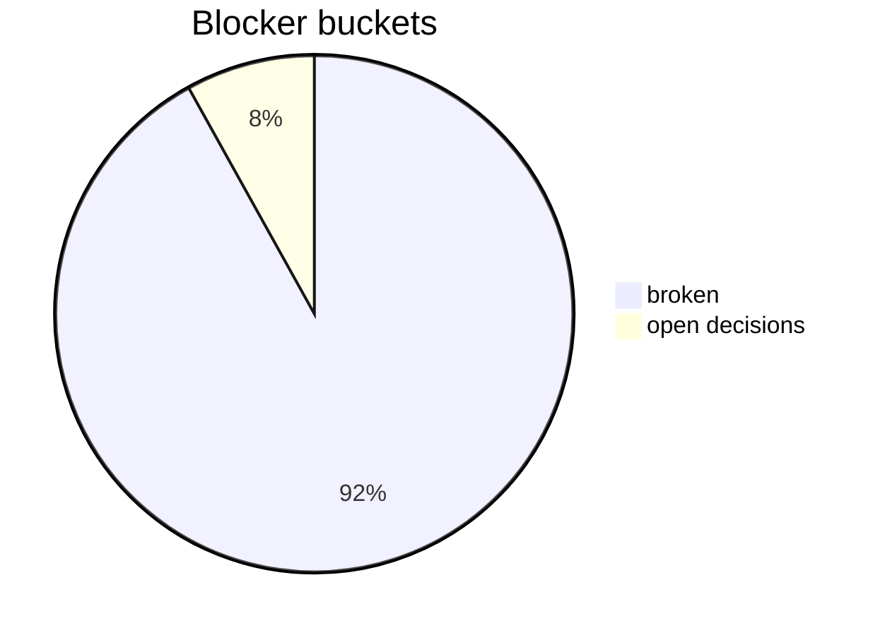

# Status Blocker

_Generated: 2026-04-16T00:00:00+00:00_

## Active broken points
- unsupported components still cannot use autonomous delivery and must still escalate or no-op safely
- what was tested:
- governance reporting and routing layers were merged and are available on `main`
- project auto-add and project views were confirmed to work with the governance label model
- branch creation and new-file repo-truth updates through the connector are working
- bridge lock-aware deploy and rollback path are validated on the real Pi
- tuner lock-aware deploy and rollback path are validated on the real Pi
- what is untested:
- broader autonomous delivery beyond the current support matrix
- a future connector path for safe in-place mutation of all protected truth files
- correct component path in repo: `journals/system-integration-normalization/`
- active SI UI/GUI governance stream path: `journals/system-integration-normalization/ui_gui_stream_v1.md`
- correct truth contracts: `contracts/repo/`
- correct support data path: `tools/governance/`
- correct branch model: `main` for truth; dedicated short-lived `si/<topic>` branches for SI/governance changes; `integration/staging` as an exception-only branch
- decision: issue routing is label-based and one central GitHub Project is used instead of one project per component.
- rationale: low owner overhead and scalable routing.
- impact: governance issues route by label, not by assignee.
- decision: autonomous execution must minimize recurring owner administration and use governed repo workflows and repo truth.
- rationale: the repo is becoming the operating system for the project.
- impact: workflows and docs must favor auto-routing, auto-reporting, and safe escalation.
- decision: cross-component and system-wide impact must escalate automatically to system integration / governance.
- rationale: chat memory is not a safe integration bus.
- impact: escalation workflows and labels are required.
- decision: autonomous delivery must be support-matrix based and conservative.
- rationale: not all components have normalized deploy/rollback contracts yet.
- impact: unsupported components must escalate or no-op safely instead of pretending delivery support exists.
- decision: the repository remains public until further notice while `main` stays protected as the truth branch.
- rationale: low-cost operation is currently preferred over private-repo administration while protected `main` still preserves truth discipline.
- impact: work happens in public branches and PRs; accepted truth still gates on protected `main`.
- decision: system integration uses short-lived repo-control-plane branches to `main` by default; `integration/staging` is exception-only.
- rationale: this minimizes branch clutter, truth ambiguity, and owner click overhead.
- impact: SI changes should normally ship as packaged PRs from temporary branches.
- decision: when tooling, connector, access, or execution problems block safe completion, agents must escalate and inform instead of improvising, faking completion, or silently creating partial truth.
- rationale: false completion is more dangerous than an explicit blocker in a governed repo.
- impact: blocking technical issues become visible repo/integration risks instead of hidden drift.
- decision: if the connector cannot safely mutate an existing protected truth file, the controlled replacement-file operating model is the standard exception path.
- rationale: protected truth must remain accurate even when the mutation surface is limited.
- impact: replacement artifacts such as `ag_new.txt` are allowed as an exception path when clearly documented.
- decision: one target Pi may have only one active deploy/test slot at a time; no other deploy may run while that slot is occupied.
- rationale: parallel deploys destroy test validity and make rollback anchors ambiguous.
- impact: deploy/test/rollback workflows must respect target-slot state such as `free`, `deploying`, `test_open`, `rollback_running`, and `blocked`.
- decision: SI/governance work must follow a dedicated branch path `si/<topic>` from local implementation to pushed branch and PR to protected `main`.
- rationale: branch clarity is required for autonomous governance discipline and avoids drift from generic local branch names.
- impact: SI lane execution, onboarding, and PR preparation now require explicit SI branch naming and same-branch promotion to `main`.
- decision: SI onboarding preflight must explicitly reject branch name `work` for SI truth changes and must verify remote `git` points to `https://github.com/SH99999/mediastreamer.git` before push/PR handoff.
- rationale: avoids ambiguous local execution and prevents pushes to the wrong remote.
- impact: replacement SI agents must run branch+remote preflight checks before packaging governed SI changes.
- decision: stage-B UI/UX autonomy requires proposal-reference fields and decision options in intake issues, plus `decision_output_v1` as canonical owner decision output block.
- rationale: repeated UI/UX iterations need deterministic automation anchors and low-click owner decision handling.
- impact: issue templates and onboarding now require proposal URI/revision and decision options; project view setup follows the in-repo blueprint.
- decision: status prompts are fulfilled via generated repo pages under `reports/status/` with clickable source links and compact visual summaries.
- rationale: reduces owner and agent overhead for recurring status requests and keeps outputs anchored to Git truth.
- impact: status handling for `status tuner|governance|ui|bridge|decisions|blocker` now maps to generated markdown artifacts.
- decision: owner decision handling is click-first via project custom fields with structured PR-comment fallback (`<!-- owner-decision-v1 -->`) and label sync automation.
- rationale: reduces repetitive owner comment overhead while preserving auditable and deterministic state transitions.
- impact: PR decision flow, state-label synchronization, and owner approval queue handling.

## Open decision blockers
- when additional components beyond bridge, tuner, and fun-line become delivery-capable in the autonomous support matrix
- whether the repository should later move to private visibility if the cost/risk tradeoff changes
- whether low-risk PR classes should later auto-merge once the current packaged-review model has matured further
- whether project view creation for `Scale Radio Governance & Delivery` should be executed by API automation or owner one-time manual apply from the canonical blueprint
- whether PR #85 faceplate bootstrap is accepted as Phase A suggestion scope before any broader governance integration package

## Source
- [SI status](/workspace/mediastreamer/journals/system-integration-normalization/STATUS_system_integration_normalization_v8.md)

## Owner action contract
- recommended owner action: `run_workflow`
- next_owner_click: `run_workflow`
- source_commit: `459699674939505afd6dbb6f31250ebe8836eb36`

## Visual snapshot

