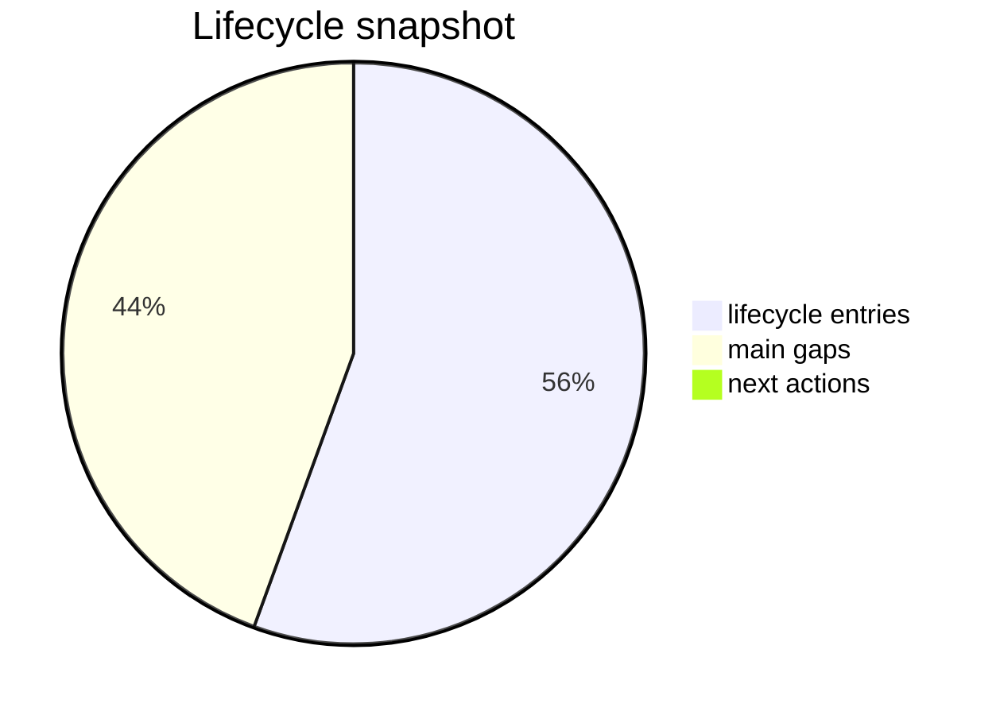

# Status Bridge

_Generated: 2026-04-16T00:00:00+00:00_

## Quick summary
- `payload_complete`
- `deployment_candidate_started`
- `deploy_ready`
- `tested_on_pi`
- `functional_acceptance_open`

## Main open points
- lyrics sync quality is still the main unresolved functional weakness
- long-run validation of `bridge_cache.sqlite` and cache reuse is still pending
- broader Spotify redesign remains intentionally frozen pending credential/API-key clarification
- current branch remains a dev lane and is not yet promoted as the accepted `main` artifact truth

## Next actions

## Sources
- [Current state](/workspace/mediastreamer/journals/scale-radio-bridge/current_state_v1.md)
- [Stream](/workspace/mediastreamer/journals/scale-radio-bridge/stream_v1.md)

## Owner action contract
- recommended owner action: `changes-requested`
- next_owner_click: `request_changes`
- decision_scoring.evidence_quality: `2`
- decision_scoring.rollback_readiness: `2`
- decision_scoring.blast_radius: `medium`
- decision_scoring.confidence: `68`
- rollback_action.command: `git revert <merge_commit_for_bridge>`
- source_commit: `44307cda45834d82763007c121982c4d2e7c78a4`

## Visual snapshot

