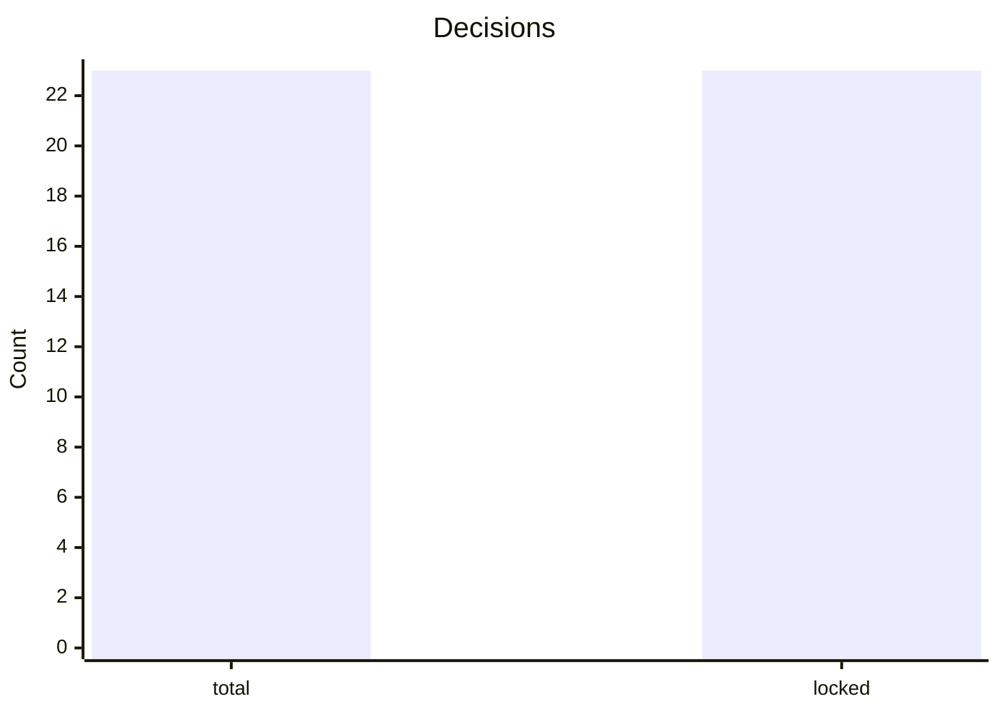

# Status Decisions

_Generated: 2026-04-16T00:00:00+00:00_

## Quick summary
- total decision entries: 23
- locked decisions: 23

## Recent decision IDs
- DEC-system_integration_normalization-28
- DEC-system_integration_normalization-29
- DEC-system_integration_normalization-30
- DEC-system_integration_normalization-32
- DEC-system_integration_normalization-31
- DEC-system_integration_normalization-33
- DEC-system_integration_normalization-34
- DEC-system_integration_normalization-35

## Source
- [SI decisions](/workspace/mediastreamer/journals/system-integration-normalization/DECISIONS_system_integration_normalization_v9.md)

## Owner action contract
- recommended owner action: `defer`
- next_owner_click: `defer`
- claim_classes.governance_docs: `accepted`
- claim_classes.runtime_validation: `not_claimed`
- claim_classes.autonomy_eligibility: `not_claimed`
- runtime_claim.evidence_path: `n/a`
- runtime_claim.tested_scope: `n/a`
- autonomy_claim.evidence_path: `n/a`
- autonomy_claim.tested_scope: `n/a`
- decision_scoring.evidence_quality: `3`
- decision_scoring.rollback_readiness: `3`
- decision_scoring.blast_radius: `low`
- decision_scoring.confidence: `85`
- rollback_action.command: `git revert <merge_commit_for_decisions>`
- source_commit: `a4aff91747304e3717a74839406b6fc8ac7f93b3`

## Visual snapshot

