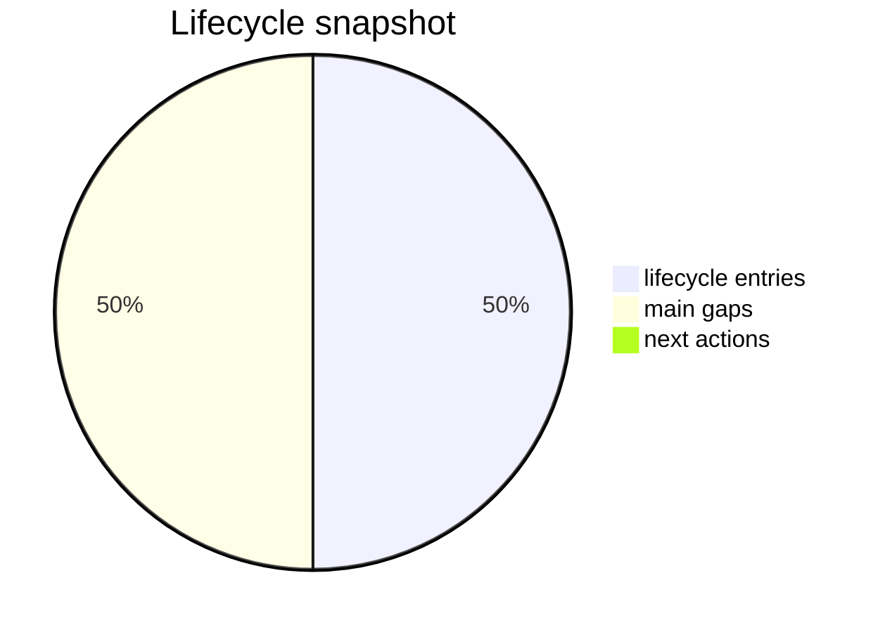

# Status Fun Line

_Generated: 2026-04-16T00:00:00+00:00_

## Quick summary
- `payload_complete`
- `deployment_candidate_started`
- `deploy_ready`
- `functional_acceptance_open`

## Main open points
- later 0.5.0 and 0.6.0 lines are not authoritative runtime baselines
- config pages repeatedly failed and remain non-authoritative
- importer/catalog workflow must be treated as unvalidated/non-working
- payload path is normalized for deploy testing, but target-Pi validation evidence is still pending

## Next actions

## Sources
- [Current state](/workspace/mediastreamer/journals/scale-radio-fun-line/current_state_v1.md)
- [Stream](/workspace/mediastreamer/journals/scale-radio-fun-line/stream_v1.md)

## Owner action contract
- recommended owner action: `changes-requested`
- next_owner_click: `request_changes`
- claim_classes.governance_docs: `accepted`
- claim_classes.runtime_validation: `not_claimed`
- claim_classes.autonomy_eligibility: `not_claimed`
- component_claims.repo_ready_payload_present: `True`
- component_claims.deploy_ready: `True`
- component_claims.tested_on_target: `False`
- component_claims.rollback_verified: `False`
- component_claims.runtime_validated: `False`
- component_claims.autonomy_eligible: `False`
- runtime_claim.evidence_path: `n/a`
- runtime_claim.tested_scope: `n/a`
- autonomy_claim.evidence_path: `n/a`
- autonomy_claim.tested_scope: `n/a`
- decision_scoring.evidence_quality: `2`
- decision_scoring.rollback_readiness: `2`
- decision_scoring.blast_radius: `medium`
- decision_scoring.confidence: `68`
- rollback_action.command: `git revert <merge_commit_for_fun-line>`
- source_commit: `c4ec33b112570bd8b52368e66e866a8c254c84bf`

## Visual snapshot

