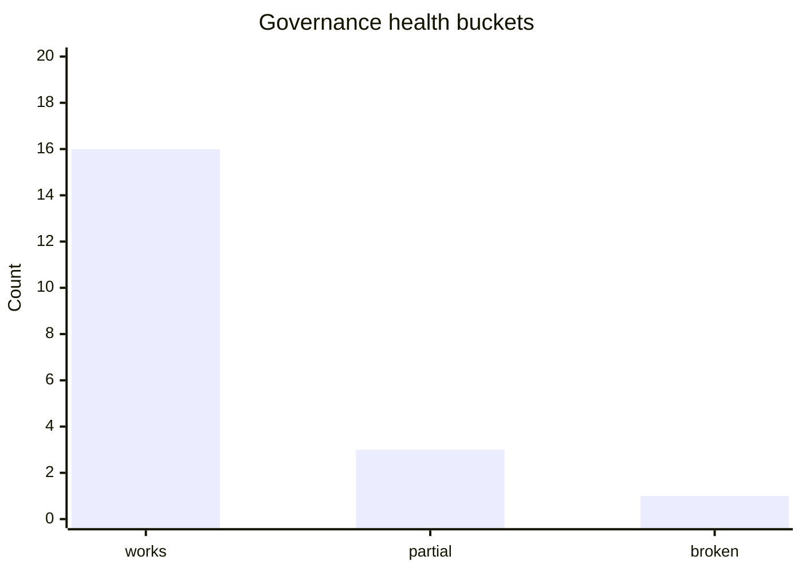

# Status Governance

_Generated: 2026-04-16T00:00:00+00:00_

## Quick summary
- governance, issue-routing, and reporting workflows exist on `main`
- governance closeout now applies evidence-gated state transitions so referenced governance issues move to `state:done` only when a merged source PR exists and governance/journal/docs truth paths were updated in the merged PR
- SI onboarding is now tiered (`Tier 0` safe-start, `Tier 1` working context, `Tier 2` deep history) and active startup truth is explicitly anchored to AGENTS + SI index + SI TOM + current SI status/decisions/stream
- status/owner packet claim classes now separate `governance/docs accepted`, `runtime validated`, and `autonomy eligible`, with evidence-gated runtime/autonomy assertions and truthful degradation when evidence is missing
- one-click branch rebase exists for all current and future `dev/*` and `integration/*` branches
- weekly governance report issues are generated from repo truth

## Partial
- autonomous delivery remains support-matrix gated, currently including Bridge and Tuner while Fun Line and other components remain unsupported until evidence-led claims are completed
- top-level truth-file mutation through the current connector surface remains limited, so replacement artifacts may still be required in some cases
- tuner deploy normalization is intentionally scoped to overlay/runtime/service while source-selection behavior remains hardware-governed (encoder short/long press) until full integration

## Blockers
- unsupported components still cannot use autonomous delivery and must still escalate or no-op safely

## Sources
- [SI status](/workspace/mediastreamer/journals/system-integration-normalization/STATUS_system_integration_normalization_v8.md)

## Owner action contract
- recommended owner action: `changes-requested`
- next_owner_click: `request_changes`
- claim_classes.governance_docs: `accepted`
- claim_classes.runtime_validation: `not_claimed`
- claim_classes.autonomy_eligibility: `not_claimed`
- component_claims.repo_ready_payload_present: `False`
- component_claims.deploy_ready: `False`
- component_claims.tested_on_target: `False`
- component_claims.rollback_verified: `False`
- component_claims.runtime_validated: `False`
- component_claims.autonomy_eligible: `False`
- runtime_claim.evidence_path: `n/a`
- runtime_claim.tested_scope: `n/a`
- autonomy_claim.evidence_path: `n/a`
- autonomy_claim.tested_scope: `n/a`
- decision_scoring.evidence_quality: `2`
- decision_scoring.rollback_readiness: `2`
- decision_scoring.blast_radius: `medium`
- decision_scoring.confidence: `68`
- rollback_action.command: `git revert <merge_commit_for_governance>`
- source_commit: `c4ec33b112570bd8b52368e66e866a8c254c84bf`

## Visual snapshot

