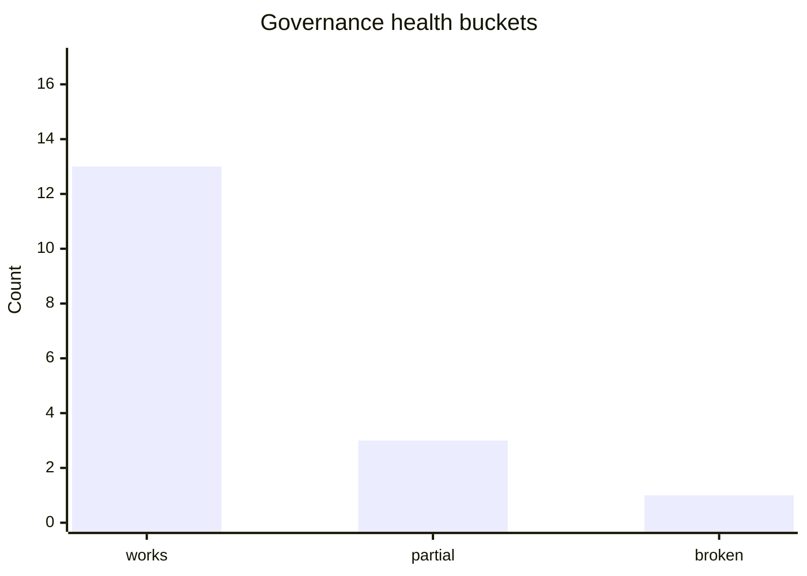

# Status Governance

_Generated: 2026-04-16T00:00:00+00:00_

## Quick summary
- governance, issue-routing, and reporting workflows exist on `main`
- one-click branch rebase exists for all current and future `dev/*` and `integration/*` branches
- weekly governance report issues are generated from repo truth
- open decisions, branch drift, and journal freshness can become governance-routed issues automatically
- PR governance review and governance closeout workflows are active
- new governed components can be bootstrapped via workflow

## Partial
- autonomous delivery remains support-matrix gated, now including Bridge, Tuner, and Fun Line while other components remain unsupported
- top-level truth-file mutation through the current connector surface remains limited, so replacement artifacts may still be required in some cases
- tuner deploy normalization is intentionally scoped to overlay/runtime/service while source-selection behavior remains hardware-governed (encoder short/long press) until full integration

## Blockers
- unsupported components still cannot use autonomous delivery and must still escalate or no-op safely

## Sources
- [SI status](/workspace/mediastreamer/journals/system-integration-normalization/STATUS_system_integration_normalization_v8.md)

## Owner action contract
- recommended owner action: `changes-requested`
- next_owner_click: `request_changes`
- source_commit: `459699674939505afd6dbb6f31250ebe8836eb36`

## Visual snapshot

