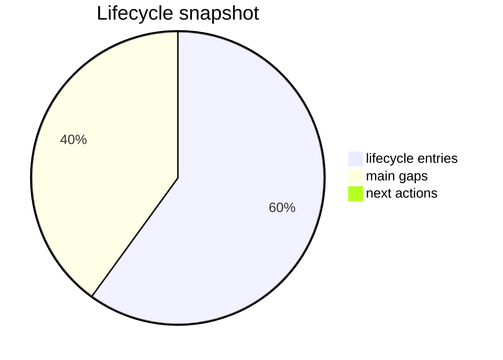

# Status Tuner

_Generated: 2026-04-16T00:00:00+00:00_

## Quick summary
- `payload_complete`
- `deployment_candidate_started`
- `deploy_ready`
- `deploy_validated_on_pi`
- `rollback_validated_on_pi`
- `manual_runtime_validation_passed`

## Main open points
- the currently normalized deploy lane intentionally covers the overlay and resident renderer service only
- `radio_scale_source` remains out of deploy-lane scope until full integration and is currently governed by hardware controls (encoder short/long press)
- first-show pointer sweep after boot remains unresolved
- exit white flashes remain unresolved

## Next actions

## Sources
- [Current state](/workspace/mediastreamer/journals/scale-radio-tuner/current_state_v2.md)
- [Stream](/workspace/mediastreamer/journals/scale-radio-tuner/stream_v2.md)

## Owner action contract
- recommended owner action: `changes-requested`
- next_owner_click: `request_changes`
- source_commit: `459699674939505afd6dbb6f31250ebe8836eb36`

## Visual snapshot

