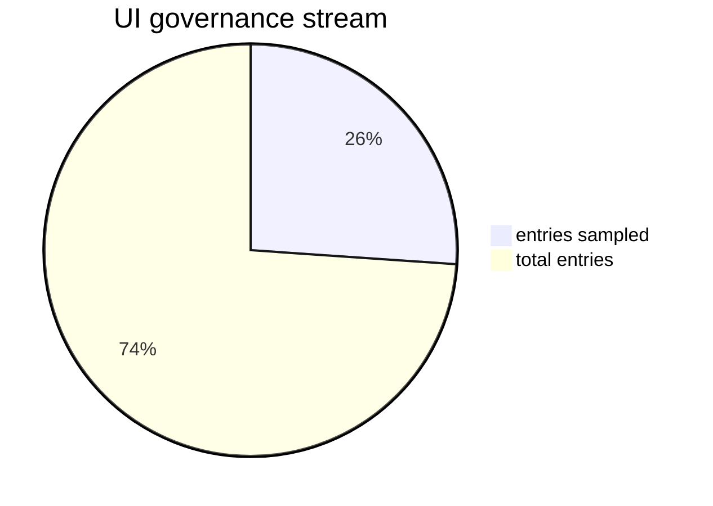

# Status UI

_Generated: 2026-04-16T00:00:00+00:00_

## Recent governance entries
- 2026-04-15: Rule recorded that UI/GUI governance entries here must be mirrored by component journals when runtime/deploy behavior changes in a component.
- 2026-04-15: Transitional decision recorded that the current GUI concept is sufficient until full integration is explicitly opened under SI governance.
- 2026-04-15: Stage-B autonomy contract added for UI/UX proposal-reference intake and owner `decision_output_v1` packet output.
- 2026-04-15: Project-view blueprint path added (`tools/governance/scale_radio_governance_delivery_views_v1.md`) for owner decision readiness in `Scale Radio Governance & Delivery`.
- 2026-04-15: Table and kanban markdown renderings added for project-view blueprint to improve owner-facing review in Git (`..._views_table_v1.md`, `..._views_kanban_v1.md`).
- 2026-04-15: Project-view triage definition was generalized to component-wide intake routing; UI/GUI remains in-scope via `agent:ux` and no longer assumes UI-only queue boundaries.

## Source
- [UI/GUI stream](/workspace/mediastreamer/journals/system-integration-normalization/ui_gui_stream_v1.md)

## Owner action contract
- recommended owner action: `accept`
- next_owner_click: `approve_pr`
- claim_classes.governance_docs: `accepted`
- claim_classes.runtime_validation: `not_claimed`
- claim_classes.autonomy_eligibility: `not_claimed`
- runtime_claim.evidence_path: `n/a`
- runtime_claim.tested_scope: `n/a`
- autonomy_claim.evidence_path: `n/a`
- autonomy_claim.tested_scope: `n/a`
- decision_scoring.evidence_quality: `3`
- decision_scoring.rollback_readiness: `3`
- decision_scoring.blast_radius: `low`
- decision_scoring.confidence: `85`
- rollback_action.command: `git revert <merge_commit_for_ui>`
- source_commit: `a4aff91747304e3717a74839406b6fc8ac7f93b3`

## Visual snapshot

